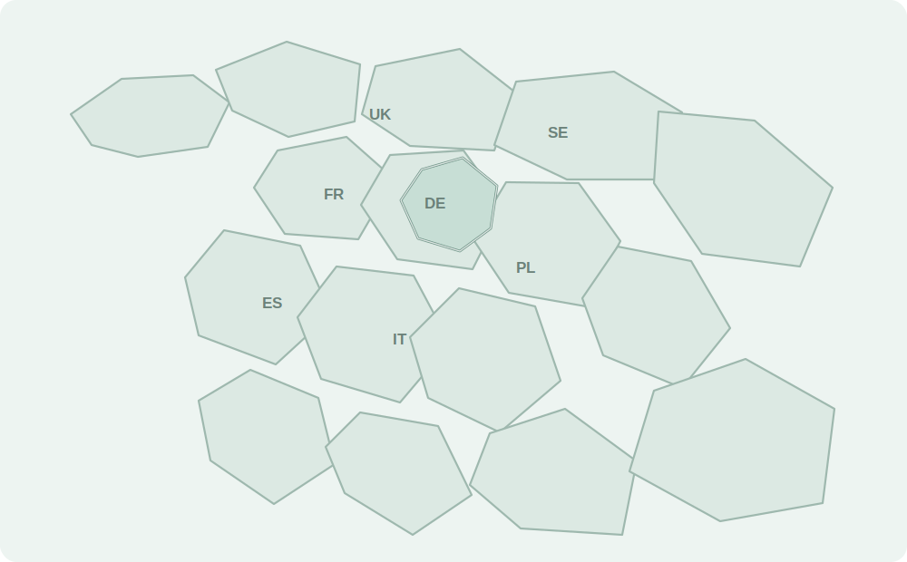

Diese Seite zeigt die öffentlich freigegebenen Praxisansätze aus `data/public/approaches.csv`. Der aktuelle Recherchestand bündelt kommunale Gesundheitszentren, regionale Ärzte- und Versorgungsnetze, sozialraumnahe Stadtteilgesundheitszentren, Lotsen- und Delegationsmodelle sowie europäische Primärversorgungsmodelle.

Die Beispiele sind noch keine abschließende Empfehlungsliste. Sie bilden einen kuratierten Startkatalog für die weitere Prüfung: Welche Modelle reduzieren Barrieren, welche Rahmenbedingungen tragen zur Verstetigung bei und welche Ansätze lassen sich auf ländliche oder strukturschwache Räume übertragen?

## Einstieg über die Karte

```{=html}
<div class="map-shell">
  <div id="practice-map" class="practice-map" aria-label="Landkarte der Praxisbeispiele">
    
    <div id="map-markers" class="map-markers"></div>
  </div>
  <div id="map-list" class="map-list" aria-label="Praxisbeispiele auf der Karte"></div>
</div>
```

## Katalog

<p id="catalog-total" class="catalog-total">Praxisbeispiele werden geladen.</p>

::: {.catalog-controls}
<label>Region oder Land<br><select id="filter-location"><option value="">Alle</option></select></label>
<label>Maßnahmentyp<br><select id="filter-type"><option value="">Alle</option></select></label>
<label>Zielgruppe<br><select id="filter-target"><option value="">Alle</option></select></label>
<label>Versorgungsthema<br><select id="filter-topic"><option value="">Alle</option></select></label>
<label>Kriterienbewertung<br><select id="filter-score"><option value="">Alle</option></select></label>
<button id="reset-filters" type="button">Filter zurücksetzen</button>
:::

<p id="catalog-count" class="catalog-count"></p>
<div id="catalog" class="catalog-grid" aria-live="polite"></div>

```{=html}
<script>
const csvUrl = "data/public/approaches.csv";
const columns = {
  location: "bundesland_land",
  type: "massnahmentyp",
  target: "zielgruppe",
  topic: "versorgungsthema",
  score: "kriterienbewertung"
};

function parseCsv(text) {
  const rows = [];
  let row = [];
  let value = "";
  let quoted = false;
  for (let i = 0; i < text.length; i += 1) {
    const char = text[i];
    const next = text[i + 1];
    if (char === '"' && quoted && next === '"') {
      value += '"';
      i += 1;
    } else if (char === '"') {
      quoted = !quoted;
    } else if (char === "," && !quoted) {
      row.push(value);
      value = "";
    } else if ((char === "\n" || char === "\r") && !quoted) {
      if (char === "\r" && next === "\n") i += 1;
      row.push(value);
      if (row.some((cell) => cell.trim() !== "")) rows.push(row);
      row = [];
      value = "";
    } else {
      value += char;
    }
  }
  row.push(value);
  if (row.some((cell) => cell.trim() !== "")) rows.push(row);
  const headers = rows.shift();
  return rows.map((cells) => Object.fromEntries(headers.map((header, index) => [header, cells[index] || ""])));
}

function uniqueValues(data, key) {
  return [...new Set(data.map((row) => row[key]).filter(Boolean))].sort((a, b) => a.localeCompare(b, "de"));
}

function fillSelect(id, values) {
  const select = document.getElementById(id);
  values.forEach((value) => {
    const option = document.createElement("option");
    option.value = value;
    option.textContent = value;
    select.appendChild(option);
  });
}

function projectPoint(row) {
  const longitude = Number.parseFloat(row.longitude);
  const latitude = Number.parseFloat(row.latitude);
  const minLon = -12;
  const maxLon = 31;
  const minLat = 35;
  const maxLat = 61;
  const x = ((longitude - minLon) / (maxLon - minLon)) * 100;
  const y = (1 - ((latitude - minLat) / (maxLat - minLat))) * 100;
  return {
    x: Math.min(96, Math.max(4, x)),
    y: Math.min(94, Math.max(6, y))
  };
}

function card(row) {
  const article = document.createElement("article");
  article.className = "catalog-card";
  article.id = `example-${row.id}`;
  article.dataset.exampleId = row.id;
  const link = row.links ? `<a href="${row.links}" rel="noopener" target="_blank">Quelle</a>` : "";
  article.innerHTML = `
    <div class="catalog-meta">${row.bundesland_land} · ${row.raumtyp} · ${row.umsetzungsstand}</div>
    <h2>${row.name}</h2>
    <p>${row.kurzbeschreibung}</p>
    <dl>
      <dt>Ort/Region</dt><dd>${row.ort_region}</dd>
      <dt>Zielgruppe</dt><dd>${row.zielgruppe}</dd>
      <dt>Thema</dt><dd>${row.versorgungsthema}</dd>
      <dt>Typ</dt><dd>${row.massnahmentyp}</dd>
      <dt>Akteure</dt><dd>${row.traeger_akteure}</dd>
      <dt>Bewertung</dt><dd>${row.kriterienbewertung}</dd>
    </dl>
    <div class="catalog-source">${row.evidenz_quellenlage}${link ? " · " + link : ""}</div>
  `;
  return article;
}

function focusExample(id) {
  document.querySelectorAll(".catalog-card").forEach((cardElement) => {
    cardElement.classList.toggle("is-highlighted", cardElement.dataset.exampleId === id);
  });
  document.querySelectorAll(".map-marker, .map-list button").forEach((element) => {
    element.classList.toggle("is-active", element.dataset.exampleId === id);
  });
  const cardElement = document.getElementById(`example-${id}`);
  if (cardElement) cardElement.scrollIntoView({ behavior: "smooth", block: "center" });
}

function renderMap(data) {
  const markerLayer = document.getElementById("map-markers");
  const list = document.getElementById("map-list");
  if (!markerLayer || !list) return;
  markerLayer.replaceChildren();
  list.replaceChildren();

  data.forEach((row) => {
    const point = projectPoint(row);
    const marker = document.createElement("button");
    marker.type = "button";
    marker.className = "map-marker";
    marker.dataset.exampleId = row.id;
    marker.style.left = `${point.x}%`;
    marker.style.top = `${point.y}%`;
    marker.setAttribute("aria-label", row.name);
    marker.title = row.name;
    marker.addEventListener("click", () => focusExample(row.id));
    markerLayer.appendChild(marker);

    const listItem = document.createElement("button");
    listItem.type = "button";
    listItem.dataset.exampleId = row.id;
    listItem.innerHTML = `<strong>${row.name}</strong><span>${row.ort_region} · ${row.bundesland_land}</span>`;
    listItem.addEventListener("click", () => focusExample(row.id));
    list.appendChild(listItem);
  });
}

function applyFilters(data) {
  const selected = Object.fromEntries(Object.entries(columns).map(([id, key]) => [key, document.getElementById(`filter-${id}`).value]));
  return data.filter((row) => Object.entries(selected).every(([key, value]) => !value || row[key] === value));
}

function render(data) {
  const filtered = applyFilters(data);
  const catalog = document.getElementById("catalog");
  catalog.replaceChildren(...filtered.map(card));
  renderMap(filtered);
  document.getElementById("catalog-total").textContent = `${data.length} Praxisbeispiele im Katalog`;
  document.getElementById("catalog-count").textContent = `${filtered.length} von ${data.length} Einträgen angezeigt`;
}

fetch(csvUrl)
  .then((response) => {
    if (!response.ok) throw new Error(`CSV konnte nicht geladen werden: ${response.status}`);
    return response.text();
  })
  .then((text) => {
    const data = parseCsv(text).filter((row) => row.veroeffentlichungsstatus === "public");
    fillSelect("filter-location", uniqueValues(data, columns.location));
    fillSelect("filter-type", uniqueValues(data, columns.type));
    fillSelect("filter-target", uniqueValues(data, columns.target));
    fillSelect("filter-topic", uniqueValues(data, columns.topic));
    fillSelect("filter-score", uniqueValues(data, columns.score));
    document.querySelectorAll(".catalog-controls select").forEach((select) => {
      select.addEventListener("change", () => render(data));
    });
    document.getElementById("reset-filters").addEventListener("click", () => {
      document.querySelectorAll(".catalog-controls select").forEach((select) => { select.value = ""; });
      render(data);
    });
    render(data);
  })
  .catch(() => {
    document.getElementById("catalog-total").textContent = "Katalogdaten konnten nicht geladen werden.";
    document.getElementById("catalog-count").textContent = "Der Katalog konnte nicht geladen werden.";
  });
</script>
```


